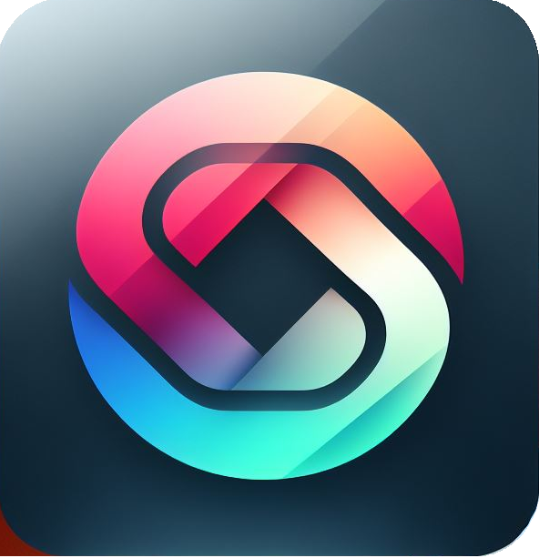

<h1 align="center" style='text-align: center; align-items: center; color: white; background: linear-gradient(103deg, rgba(7, 175, 242, 0.81) 0%, rgb(73 97 255 / 67%) 100%);'>
     
    TADASHI - Generative AI
</h1>

TADASHI is a generative AI chat application that uses Google's Deepmind Gemini API to generate responses. Tadashi can respond to user prompts, solve logical problems with reasoning, perform basic tasks and has a knowledge base of multiple languages that can be used for translation. 
It also has the capability to summarize content either in general or summarize the contents of a website by providing a prompt with the desired URL.

[TADASHI - Generative AI DEMO](https://tadashi-ai.vercel.app) 
(Please note: The site will take some time to load initially)

## Preview

    

        
        

            Ability to summarize text and generate code
        

    

       
    

        
        

            Translation and understanding of foreign languages and text
        

    

       
    

        
        

            Content Generation
        

    

       
    

        
        

            Semantic extraction and task Execution
        

    

       
    

        
        

            Chat modes, each mode will shift the probability of finding the right candidate response
        

    

       

# AIM
To Study and understand Generative AI and Large Language Models.

# Introduction
Generative AI refers to any AI system that can generate content such as text, images, and code. Generative AI and Large Language models are a subset deep learning models.

## Large Language Models (LLM)
Large Language Models, as the  term suggests is a language model that is trained on a large set of text/language data (petabytes worth). This data will include categories and patterns that define it such as language, sentiement. This will help the LLM understand these patterns during training. 

These models are trained in <b>general</b> to decode text based data and can be <b>fine tuned</b> for specific implmentations.

One such LLM that I have used is the BERT model for question answering based on transformers, which you can find here: [React-QnA-NLP-Module](https://github.com/RyanDC1/React-QnA-NLP-Module)

<u><b>General Purpose ( Pre-trained models )</b></u> 
Models are trained to solve common langauge tasks such as:
1. <b>Text Classification:</b> Ability to categorize parts of text which can be later used for applications such as sentiment analysis, spam detection etc. This is done by co-relating paterns that are detected with the pre-trained dataset.
2. <b>Question Answering:</b> Given a context (text data), ability to find the most probable answer within the context based on a question.
3. <b>Document Summarization:</b> Create a brief description of a larger text while retaining semantics.
4. <b>Text Generation:</b> Creating content from a given context.

_While General purpose models solve a lot of language tasks, they cannot directly be used for a specific application as the context and data set is large and may often produce an undesired response. This is where fine tuned models come into play._

<u><b>Fine Tuning</b></u> 
Let's say in addition to the basic language tasks we want our application to do additional tasks or refer to a subset of data such as medical data. Large language models need a specific context or training on top of the pre-trained models in order to be used for specifc applications. The idea of creating application specific LLM's from scratch is resource intensive, hence using Pre-trained models as a backbone is more efficient.

_A good example is as explained by John Ewald in [Introduction to LLM](https://youtu.be/zizonToFXDs?t=58). The example states that we can train a dog to follow basic commands such as 'Sit', 'Follow' and 'Stay', however if we need a special-service dog such as a guide dog or a police dog, we need to add "special trainings" to the basic training._

Special trainings allow the LLM to be fine tuned to a specific application without having to re-train the basic tasks such as text classification (a form of Transfer learning).

Special training can be a set of language data based on which the LLM must be trained.

_for example if we want to build a customer support bot for a car company, the training dataset would include all the data about the company, their products and their services. The new model can now perform the same basic tasks, but with the context of the companies data in addition to the original dataset._

## Generative AI
While LLM's are specifically designed to generate and process text based content, Generative AI are designed to be <b>multi modal</b>, i.e. they can take text or an image as input and produce text, images, code, music or video as content. This makes LLM a subset of Generative AI.

## References
- Research and Documentation
    - Gemini API: https://ai.google.dev/docs/concepts
    - LLM Concepts and Generative AI: 
        - [Concepts](https://ai.google.dev/docs/concepts)
        - [LLMS](https://www.youtube.com/watch?v=zizonToFXDs)
        - [Generative AI](https://www.youtube.com/watch?v=G2fqAlgmoPo)
        - [How does Generative AI work](https://www.simform.com/blog/how-does-generative-ai-work/)
    - Prompt Best Practices: https://ai.google.dev/docs/prompt_best_practices

- Tools and Resources
    - Redux Toolkit: https://redux-toolkit.js.org
    - Vite Module Bundler: https://vitejs.dev/guide
    - SVG Backgrounds: https://haikei.app
    - Icons: https://www.iconpacks.net

## Local Instance
This project has a few environment variables that need to be configured for it to run locally.
please refer to .env.example files in root and server directory

1. create .env.development files
2. [get Gemini api key](https://cloud.google.com/vertex-ai/docs/generative-ai/model-reference/gemini)
3. install all dependencies using pnpm i in root and server directory
4. run pnpm dev in root
5. run pnpm dev in server directory
